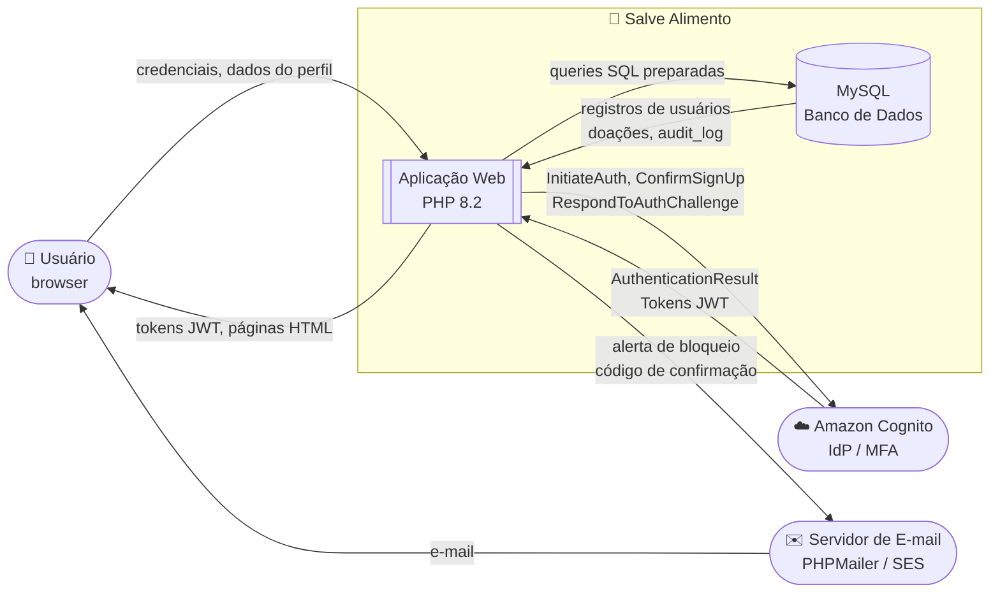
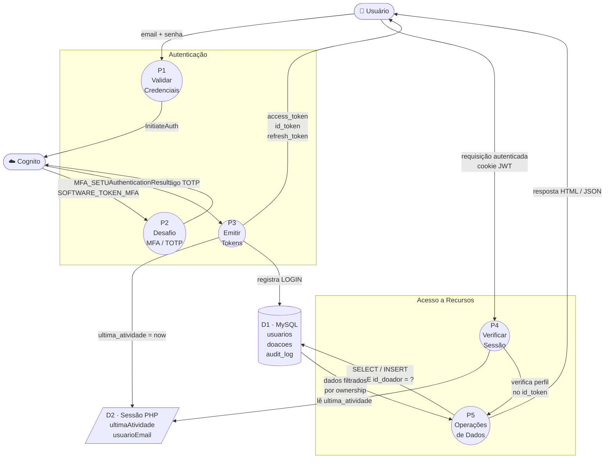

# DFD e Análise STRIDE — Salve Alimento

---

## DFD Nível 0 — Diagrama de Contexto

Visão geral do sistema e suas entidades externas.

---

## DFD Nível 1 — Fluxo de Autenticação

Detalha o fluxo interno de login com MFA e emissão de tokens.

---

## Tabela STRIDE

Análise de ameaças para os fluxos identificados no DFD.

| # | Ameaça STRIDE | Componente (DFD) | Descrição da ameaça | Mitigação implementada | Requisito |
|---|---------------|-----------------|---------------------|----------------------|-----------|
| T01 | **S**poofing | P1 – Validar Credenciais | Atacante se passa por usuário legítimo com credenciais roubadas | MFA obrigatório via TOTP (Cognito); mesmo com senha correta, segundo fator é exigido | RS01 |
| T02 | **S**poofing | P3 – Emitir Tokens | Atacante forja ou reutiliza token JWT expirado | Tokens assinados com RS256; validados via JWKS público do Cognito; `exp` verificado a cada request | RS02 |
| T03 | **T**ampering | P4 – Verificar Sessão | Atacante altera payload do JWT para elevar privilégios | Assinatura RS256 detecta qualquer alteração; token inválido resulta em HTTP 401 | RS02 |
| T04 | **T**ampering | D1 – MySQL | Atacante injeta SQL para ler ou modificar dados de outros usuários | PDO com `prepare()` + `execute()`; `ATTR_EMULATE_PREPARES = false`; ownership check em toda query de mutação | RS04 |
| T05 | **R**epudiation | P5 – Operações de Dados | Usuário nega ter realizado ação (doação, solicitação, login) | `AuditService` registra todas as ações com timestamp, IP e hash SHA-256 encadeado | RS12 |
| T06 | **I**nformation Disclosure | D1 – MySQL | Vazamento do banco expõe CPF e endereço dos usuários | CPF e endereço armazenados cifrados (AES-256-GCM + RSA-OAEP); servidor nunca recebe texto puro | RS08 |
| T07 | **I**nformation Disclosure | P3 – Emitir Tokens | Token JWT interceptado em trânsito expõe sessão | HTTPS obrigatório (TLS 1.2/1.3); HSTS ativo; cookies com `Secure` + `HttpOnly` + `SameSite=Strict` | RS09, RS11 |
| T08 | **D**enial of Service | P1 – Validar Credenciais | Ataque de força bruta esgota tentativas de login | Rate limiting: 5 tentativas → bloqueio de 15 min; alerta por e-mail ao titular | RS06 |
| T09 | **D**enial of Service | D2 – Sessão PHP | Sessões abandonadas consomem recursos e mantêm acesso indevido | Timeout de 30 min por inatividade; `sessaoExpirada()` invalida sessão e limpa cookies | RS07 |
| T10 | **E**levation of Privilege | P4 – Verificar Sessão | Usuário com perfil `doador` acessa rotas de `admin` | RBAC por perfil extraído do `custom:perfil` do IdToken; cada rota verifica o perfil antes de executar | RS02 |
| T11 | **E**levation of Privilege | P5 – Operações de Dados | Usuário acessa ou modifica recurso de outro usuário (IDOR) | `Doacao::pertenceAoDoador()` e cláusula `AND id_doador = ?` em toda operação; HTTP 403 se falhar | RS03 |
| T12 | **T**ampering | Formulários HTML | Atacante injeta scripts via campos de entrada (XSS) | `CSP: default-src 'self'` bloqueia scripts inline e externos; `htmlspecialchars()` em todo output | RS10 |
